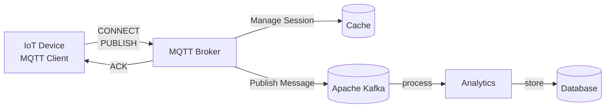

# MQTT Broker

## MQTT Broker Architecture


## Supported MQTT QoS
```
- QoS 0 : No ACK, fire and forget
- QoS 1 : Receiver send ACK to sender
- QoS 2 : Both side ACK from sender and receiver
```

## Installation requirement
```
Java 21, Maven, Redis, Apache Kafka
```

## Build MQTT broker
```
mvn clean install
```

## Run standalone MQTT broker
```
java -jar mqtt-broker-1.0-SNAPSHOT.jar
```

## MQTT broker IP/Port
```
host: 0.0.0.0
port: 1883

mqtt://127.0.0.1:1883

mqtts://127.0.0.1:1883
```

## MQTT client simulator
```
 https://mqttx.app/downloads
```

## For SSL config for server/device
```
./src/main/resources/application.yml

  tls:
    enabled: true
```
## Challenge enable or disable configs
```
./src/main/resources/application.yml

    challenge:
      enabled: true 
      load-dummy-challenges: true 
```
## Challenge message type and request/response
```
Topic: $system/challenge
{
"type": "CHALLENGE",
"messageId": "msg-1001",
"question": "what is model number?"
}

Topic: $system/challenge
{
"type": "CHALLENGE",
"messageId": "msg-1001",
"question": "what is model number?",
"answer": "XX00178"
}
```

## To generate self signed SSL certificate
- [Server side SSL doc](Server-TLS.md)
- [Device side SSL doc](Device-TLS.md)
- Note: Default certs generated in folder /mqtt-broker/certs/ for server and device.

## Cache integration
```
./src/main/resources/application.yml

cache:
  in-memory:
    enabled: true # in-memory cache enabled or not, false-OFF, true-ON

  off-memory:
    enabled: false # standalone redis cache enabled or not, false-OFF, true-ON

```

## Kafka integration
```
./src/main/resources/application.yml

kafka:
  enabled: true # kafka integration is enabled or not, false-OFF, true-ON
  
```


